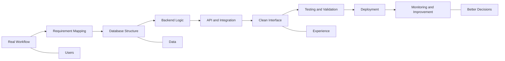

<!--
  GitHub Profile README for Umar Maulana
  Mode: Stable Monochrome Edition
  Notes: No broken stats widgets, no external visual generators, no emoji.
  Domain: umrmaulana.my.id
-->

<div align="center">

# UMAR MAULANA

### Web Developer · Mobile Developer · Digital System Builder

<sub>Building clean interfaces, practical dashboards, inventory workflows, map-based systems, and tools that solve real operational problems.</sub>

<br />
<br />

[Portfolio](https://umrmaulana.my.id) · [GitHub](https://github.com/umrmaulana) · [LinkedIn](https://id.linkedin.com/in/umrmaulana) · [Email](mailto:umrmaulana1@gmail.com)

[Instagram](https://instagram.com/umrmaulana) · [X](https://x.com/umrmaulana) · [Facebook](https://facebook.com/umrmaulana3) · [Telegram](https://t.me/Umrmaulana)

</div>

---

<div align="center">

```txt
┌──────────────────────────────────────────────────────────────────────────────┐
│                                                                              │
│   SYSTEM ONLINE                                                              │
│   USER            Umar Maulana                                               │
│   ROLE            Web & Mobile Developer                                     │
│   DOMAIN          umrmaulana.my.id                                           │
│   FOCUS           Laravel · React · Flutter · Next.js · Docker               │
│   DIRECTION       Clean systems, useful workflows, practical automation       │
│                                                                              │
└──────────────────────────────────────────────────────────────────────────────┘
```

</div>

## Profile Brief

<table>
  <tr>
    <td width="58%" valign="top">
      <p>
        I am an Informatics Engineering student focused on web and mobile application development. I build practical digital systems for dashboards, inspection workflows, inventory management, API-based product data, and map-based information systems.
      </p>
      <p>
        My background combines software development, data handling, inventory planning, UI structure, documentation, and cross-functional teamwork. I like turning real operational problems into clean, useful, and maintainable systems.
      </p>
    </td>
    <td width="42%" valign="top">
      <pre><code>developer.card
name       Umar Maulana
location   Indonesia
portfolio  umrmaulana.my.id
stack      Laravel, React, Flutter
style      clean, precise, adaptive
status     building useful systems</code></pre>
    </td>
  </tr>
</table>

---

## Command Center

<table>
  <tr>
    <td width="25%" align="center"><b>Web Systems</b><br />Laravel dashboards, admin panels, internal workflows, and monitoring tools.</td>
    <td width="25%" align="center"><b>Mobile Apps</b><br />Android and Flutter application flows with practical product features.</td>
    <td width="25%" align="center"><b>Data Flow</b><br />Database, API, reporting, inventory control, and operational visibility.</td>
    <td width="25%" align="center"><b>Visual Structure</b><br />Interface layout, system diagrams, user flow, and documentation clarity.</td>
  </tr>
</table>

---

## Technology Stack

<table>
  <tr>
    <td width="25%" valign="top">
      <b>Languages</b><br /><br />
      PHP<br />
      JavaScript<br />
      Dart<br />
      Python<br />
      C++
    </td>
    <td width="25%" valign="top">
      <b>Frameworks</b><br /><br />
      Laravel<br />
      React<br />
      Next.js<br />
      Flutter<br />
      CodeIgniter<br />
      Tailwind CSS<br />
      Bootstrap
    </td>
    <td width="25%" valign="top">
      <b>Database & Tools</b><br /><br />
      MySQL<br />
      SQL Server<br />
      Firebase<br />
      Supabase<br />
      Git<br />
      Docker<br />
      Postman
    </td>
    <td width="25%" valign="top">
      <b>Design & Analysis</b><br /><br />
      Figma<br />
      CorelDRAW<br />
      Canva<br />
      ERD<br />
      Flowchart<br />
      Use Case Diagram<br />
      Microsoft Office
    </td>
  </tr>
</table>

---

## Skill Matrix

> Stable version: this section uses text-based visual meters, so it will not break if third-party image services are down.

<table>
  <tr>
    <td width="50%" valign="top">
      <b>Engineering Execution</b><br /><br />
      <pre><code>Laravel          ██████████████████░░  90%
Frontend         ████████████████░░░░  80%
Mobile Flow      ███████████████░░░░░  75%
Database & API   █████████████████░░░  85%
Deployment       ███████████████░░░░░  75%</code></pre>
    </td>
    <td width="50%" valign="top">
      <b>Product Thinking</b><br /><br />
      <pre><code>Workflow Mapping ██████████████████░░  90%
Dashboard Logic  █████████████████░░░  85%
UI Structure     ████████████████░░░░  80%
Documentation    █████████████████░░░  85%
Problem Solving  ██████████████████░░  90%</code></pre>
    </td>
  </tr>
</table>

---

## System Architecture Mindset



---

## Selected Work

<table>
  <tr>
    <td width="50%" valign="top">
      <h3>SISCA</h3>
      <b>System Information Safety Checksheet Aisin</b>
      <p>A Laravel-based website for emergency safety equipment checks at PT. Aisin Indonesia, supported by inspection status, area mapping, and QR code checking flow.</p>
      <p><b>Stack:</b> Laravel, MySQL, QR workflow, mapping, dashboard</p>
    </td>
    <td width="50%" valign="top">
      <h3>System Inventory Aisin</h3>
      <b>Warehouse and stock movement system</b>
      <p>A Filament Laravel system for warehouse operations, order flow, production movement, and stock monitoring.</p>
      <p><b>Stack:</b> Laravel, Filament, MySQL, admin panel</p>
    </td>
  </tr>
  <tr>
    <td width="50%" valign="top">
      <h3>KLA Computer Mobile App</h3>
      <b>Mobile sales application</b>
      <p>A mobile product sales app supported by dynamic product API and web-based admin panel for product data management.</p>
      <p><b>Stack:</b> Java, PHP, MySQL, REST API</p>
    </td>
    <td width="50%" valign="top">
      <h3>WebGIS Kudus</h3>
      <b>Geographic information system</b>
      <p>A website for HIV/AIDS case information by district in Kabupaten Kudus, supported by QGIS and admin-managed data.</p>
      <p><b>Stack:</b> PHP Native, QGIS, JavaScript, MySQL</p>
    </td>
  </tr>
  <tr>
    <td width="50%" valign="top">
      <h3>Home Server Linux Armbian</h3>
      <b>Personal server environment</b>
      <p>A self-managed server using STB TV, Armbian, aaPanel, Docker, and periodic maintenance workflow.</p>
      <p><b>Stack:</b> Linux, Armbian, Docker, aaPanel</p>
    </td>
    <td width="50%" valign="top">
      <h3>WebGIS Repository</h3>
      <b>Public geospatial exploration</b>
      <p>Repository for geospatial system exploration and web-based map interface development.</p>
      <p><a href="https://github.com/umrmaulana/webGIS">github.com/umrmaulana/webGIS</a></p>
    </td>
  </tr>
</table>

---

## GitHub Signal

> Stable version: this section uses official GitHub links instead of third-party stat cards, so visitors will not see broken images.

<table>
  <tr>
    <td width="25%" align="center">
      <b>Profile</b><br />
      <a href="https://github.com/umrmaulana">Open GitHub Profile</a>
    </td>
    <td width="25%" align="center">
      <b>Repositories</b><br />
      <a href="https://github.com/umrmaulana?tab=repositories">View Repositories</a>
    </td>
    <td width="25%" align="center">
      <b>Projects</b><br />
      <a href="https://github.com/umrmaulana?tab=projects">View Projects</a>
    </td>
    <td width="25%" align="center">
      <b>Stars</b><br />
      <a href="https://github.com/umrmaulana?tab=stars">View Stars</a>
    </td>
  </tr>
</table>

<br />

<div align="center">

```txt
┌─ github.signal ──────────────────────────────────────────────────────────────┐
│ profile        github.com/umrmaulana                                        │
│ repositories   github.com/umrmaulana?tab=repositories                       │
│ projects       github.com/umrmaulana?tab=projects                           │
│ stars          github.com/umrmaulana?tab=stars                              │
│ portfolio      umrmaulana.my.id                                             │
└──────────────────────────────────────────────────────────────────────────────┘
```

</div>

---

## Experience Timeline

<table>
  <tr>
    <td width="25%" align="center"><b>2021 - 2023</b><br />Planning Inventory Management<br />PT. Astra Daihatsu Motor</td>
    <td width="25%" align="center"><b>2023 - Present</b><br />D3 Informatics Engineering<br />Universitas Dian Nuswantoro</td>
    <td width="25%" align="center"><b>2024 - 2025</b><br />Head of Student Association<br />Himpunan Mahasiswa</td>
    <td width="25%" align="center"><b>2025</b><br />SHE System Development<br />PT. Aisin Indonesia</td>
  </tr>
</table>

---

## Working Principles

<table>
  <tr>
    <td width="20%" align="center"><b>Understand</b><br />Start from the actual workflow and user problem.</td>
    <td width="20%" align="center"><b>Structure</b><br />Turn ideas into database, flow, and interface logic.</td>
    <td width="20%" align="center"><b>Build</b><br />Ship practical web and mobile systems.</td>
    <td width="20%" align="center"><b>Validate</b><br />Test features against real operational needs.</td>
    <td width="20%" align="center"><b>Improve</b><br />Maintain, refine, and make systems easier to use.</td>
  </tr>
</table>

---

## Certifications

<table>
  <tr>
    <td width="33%" align="center"><b>Mobile Apps Development</b><br />LSP UDINUS, 2025</td>
    <td width="33%" align="center"><b>Code Generation and Optimization</b><br />IBM SkillBuild, 2025</td>
    <td width="33%" align="center"><b>Junior Web Development</b><br />LSP UDINUS, 2024</td>
  </tr>
  <tr>
    <td width="33%" align="center"><b>Fullstack Developer</b><br />Codepolitan, 2023</td>
    <td width="33%" align="center"><b>Junior Web Development</b><br />BNSP SKKNI, 2021</td>
    <td width="33%" align="center"><b>Continuous Learning</b><br />Software, systems, and design</td>
  </tr>
</table>

---

## Connect

<table>
  <tr>
    <td width="33%" align="center"><b>Portfolio</b><br /><a href="https://umrmaulana.my.id">umrmaulana.my.id</a></td>
    <td width="33%" align="center"><b>Email</b><br /><a href="mailto:umrmaulana1@gmail.com">umrmaulana1@gmail.com</a></td>
    <td width="33%" align="center"><b>LinkedIn</b><br /><a href="https://id.linkedin.com/in/umrmaulana">id.linkedin.com/in/umrmaulana</a></td>
  </tr>
  <tr>
    <td width="33%" align="center"><b>Instagram</b><br /><a href="https://instagram.com/umrmaulana">instagram.com/umrmaulana</a></td>
    <td width="33%" align="center"><b>X</b><br /><a href="https://x.com/umrmaulana">x.com/umrmaulana</a></td>
    <td width="33%" align="center"><b>Telegram</b><br /><a href="https://t.me/Umrmaulana">t.me/Umrmaulana</a></td>
  </tr>
  <tr>
    <td width="33%" align="center"><b>Facebook</b><br /><a href="https://facebook.com/umrmaulana3">facebook.com/umrmaulana3</a></td>
    <td width="33%" align="center"><b>GitHub</b><br /><a href="https://github.com/umrmaulana">github.com/umrmaulana</a></td>
    <td width="33%" align="center"><b>Repository</b><br /><a href="https://github.com/umrmaulana?tab=repositories">View repositories</a></td>
  </tr>
</table>

---

<div align="center">

```txt
build clean · ship useful · improve continuously
```

<sub>Designed as a stable monochrome GitHub profile README without fragile third-party visual widgets.</sub>

</div>
