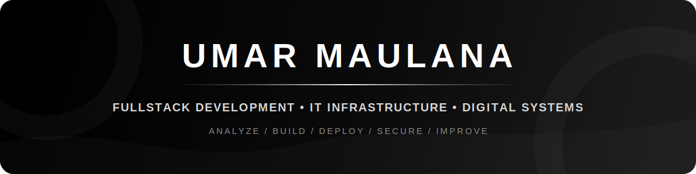
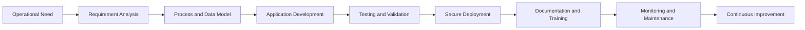

<!--
  GitHub Profile README for Umar Maulana
  Direction: monochrome, professional, CV-driven, no emoji
  Required local assets:
  - assets/github-header.svg
  - assets/github-footer.svg
-->

  

  
  
  
  

  
  
  
  

 

<table width="100%">
  <tr>
    <td width="61%" valign="top">
      <h2>Profile Brief</h2>
      

        Diploma graduate in Informatics Engineering with a <b>3.96 GPA</b>, focused on
        fullstack application development and IT infrastructure management.
      

      

        I build integrated operational systems using Laravel, Tailwind CSS, databases,
        role-based access control, and structured approval workflows. My experience also
        covers web deployment, SSL and Cloudflare management, network maintenance,
        backup procedures, technical documentation, and hardware troubleshooting.
      

      

        My approach is centered on translating real operational needs into secure,
        maintainable, and practical digital solutions.
      

    </td>
    <td width="39%" valign="top">
      <h2>Professional Snapshot</h2>
      
<b>Current Role</b> IT Staff at PT. Sentral Medika Indoputra

      
<b>Education</b> D3 Informatics Engineering, Universitas Dian Nuswantoro

      
<b>Core Focus</b> Fullstack systems, ERP/HRIS, deployment, and infrastructure

      
<b>Based In</b> Demak, Central Java, Indonesia

    </td>
  </tr>
</table>

 

<h2 align="center">Core Direction</h2>

<table width="100%">
  <tr>
    <td align="center" width="25%" valign="top">
      <h3>Enterprise Systems</h3>
      
ERP, HRIS, warehouse, sales monitoring, approval flows, and internal portals.

    </td>
    <td align="center" width="25%" valign="top">
      <h3>Web Engineering</h3>
      
Laravel applications, responsive interfaces, APIs, authentication, and RBAC.

    </td>
    <td align="center" width="25%" valign="top">
      <h3>IT Infrastructure</h3>
      
Deployment, SSL, Cloudflare, networking, backups, maintenance, and troubleshooting.

    </td>
    <td align="center" width="25%" valign="top">
      <h3>System Documentation</h3>
      
UML, ERD, flowcharts, approval guides, tutorials, and technical handover documents.

    </td>
  </tr>
</table>

 

<h2 align="center">Technology Stack</h2>

  
  
  
  
  
  
  
  

  
  
  
  
  
  
  
  

  
  
  
  
  
  

 

<h2 align="center">Technical Expertise</h2>

<table width="100%">
  <tr>
    <td width="50%" valign="top">
      <h3>Application Engineering</h3>
      

        Laravel and PHP development, responsive interfaces, authentication,
        role-based access control, workflow automation, REST APIs, and application maintenance.
      

    </td>
    <td width="50%" valign="top">
      <h3>Infrastructure and Deployment</h3>
      

        Domain and application deployment, SSL renewal, Cloudflare integration,
        network maintenance, backup and recovery, endpoint support, and troubleshooting.
      

    </td>
  </tr>
  <tr>
    <td width="50%" valign="top">
      <h3>Data and System Design</h3>
      

        MySQL, SQL Server, Firebase, Supabase, database modeling, ERD, UML,
        flowcharts, use case diagrams, reporting, and operational data validation.
      

    </td>
    <td width="50%" valign="top">
      <h3>Delivery and Collaboration</h3>
      

        Requirement analysis, user observation, system implementation,
        technical documentation, approval guides, team communication, and continuous improvement.
      

    </td>
  </tr>
</table>

 

<h2 align="center">System Architecture Mindset</h2>

 

<h2 align="center">Featured Systems</h2>

<table width="100%">
  <tr>
    <td width="50%" valign="top">
      <h3>Portal Indoputra</h3>
      
<b>Enterprise Resource Planning and HRIS Portal</b>

      

        An integrated company portal that digitizes cross-department workflows,
        including attendance, leave, overtime, reimbursement, Up Country requests,
        warehouse operations, stock monitoring, sales performance, marketing prospects,
        and IT helpdesk tickets.
      

      
<b>Core:</b> Laravel, Tailwind CSS, MySQL, RBAC, approval workflow

    </td>
    <td width="50%" valign="top">
      <h3>Career Indoputra</h3>
      
<b>Centralized Recruitment Platform</b>

      

        A digital recruitment platform for vacancy publishing and online applications,
        supported by applicant data management, email blasting automation,
        and a dynamic content management module for the HR team.
      

      
<b>Core:</b> Laravel, MySQL, CMS, email automation, HR workflow

    </td>
  </tr>
  <tr>
    <td width="50%" valign="top">
      <h3>SISCA</h3>
      
<b>System Information Safety Checksheet Aisin</b>

      

        An end-to-end Laravel system for emergency safety equipment inspections,
        featuring interactive area mapping, inspection status monitoring,
        QR code scanning, and field implementation inside the factory environment.
      

      
<b>Core:</b> Laravel, MySQL, QR workflow, mapping, UML documentation

    </td>
    <td width="50%" valign="top">
      <h3>System Inventory Aisin</h3>
      
<b>Warehouse and Production Movement System</b>

      

        A Filament Laravel application for warehouse management, covering product orders,
        production movement, and stock availability monitoring through an administrative interface.
      

      
<b>Core:</b> Laravel, Filament, MySQL, inventory workflow

    </td>
  </tr>
</table>

 

<h2 align="center">Professional Journey</h2>

<table width="100%">
  <tr>
    <td width="24%" valign="top"><b>Dec 2025 - Present</b></td>
    <td width="76%" valign="top">
      <b>IT Staff - PT. Sentral Medika Indoputra</b> 
      Develops internal business systems, manages company web infrastructure,
      maintains networks and operational devices, handles backups, and prepares technical documentation.
    </td>
  </tr>
  <tr>
    <td width="24%" valign="top"><b>Jul 2025 - Oct 2025</b></td>
    <td width="76%" valign="top">
      <b>SHE Intern - PT. Aisin Indonesia</b> 
      Designed, developed, documented, and implemented SISCA to digitize emergency safety equipment inspections.
    </td>
  </tr>
  <tr>
    <td width="24%" valign="top"><b>2024 - 2025</b></td>
    <td width="76%" valign="top">
      <b>Chairman - Informatics Engineering Student Association</b> 
      Led organizational activities while completing the Diploma in Informatics Engineering.
    </td>
  </tr>
  <tr>
    <td width="24%" valign="top"><b>Aug 2023 - May 2024</b></td>
    <td width="76%" valign="top">
      <b>Crew Outlet - Noms Kopi Demak</b> 
      Managed customer service, transactions, product preparation, and stock operations independently.
    </td>
  </tr>
  <tr>
    <td width="24%" valign="top"><b>May 2021 - Apr 2023</b></td>
    <td width="76%" valign="top">
      <b>Planning Inventory Management SSP - PT. Astra Daihatsu Motor</b> 
      Controlled physical and digital part movement, validated production material data,
      and coordinated with logistics teams and suppliers.
    </td>
  </tr>
</table>

 

<h2 align="center">GitHub Workspace</h2>

  
  
  

<table width="100%">
  <tr>
    <td width="33%" align="center" valign="top">
      <h3>Primary Focus</h3>
      
Enterprise web applications, operational workflows, and internal digital systems.

    </td>
    <td width="33%" align="center" valign="top">
      <h3>Development Method</h3>
      
Structured commits, reusable components, documentation, testing, and iterative improvement.

    </td>
    <td width="34%" align="center" valign="top">
      <h3>Public Exploration</h3>
      
WebGIS, interfaces, mapping workflows, and project-based software development.

    </td>
  </tr>
</table>

  
  
  

 

<h2 align="center">How I Work</h2>

<table width="100%">
  <tr>
    <td align="center" width="20%" valign="top">
      <h3>01</h3>
      <b>Analyze</b> 
      Understand the real workflow, users, risks, and required outcomes.
    </td>
    <td align="center" width="20%" valign="top">
      <h3>02</h3>
      <b>Structure</b> 
      Translate requirements into process flows, data models, roles, and permissions.
    </td>
    <td align="center" width="20%" valign="top">
      <h3>03</h3>
      <b>Build</b> 
      Develop focused features with clean interfaces and maintainable application logic.
    </td>
    <td align="center" width="20%" valign="top">
      <h3>04</h3>
      <b>Secure</b> 
      Validate access, deployment, backups, infrastructure, and operational continuity.
    </td>
    <td align="center" width="20%" valign="top">
      <h3>05</h3>
      <b>Improve</b> 
      Document, monitor, maintain, and refine the system based on actual use.
    </td>
  </tr>
</table>

 

<h2 align="center">Professional Certifications</h2>

<table width="100%">
  <tr>
    <td width="18%" align="center"><b>2025</b></td>
    <td width="50%"><b>Mobile Apps Development</b></td>
    <td width="32%">LSP UDINUS</td>
  </tr>
  <tr>
    <td width="18%" align="center"><b>2025</b></td>
    <td width="50%"><b>Code Generation and Optimization</b></td>
    <td width="32%">IBM SkillsBuild</td>
  </tr>
  <tr>
    <td width="18%" align="center"><b>2024</b></td>
    <td width="50%"><b>Junior Web Development</b></td>
    <td width="32%">LSP UDINUS</td>
  </tr>
  <tr>
    <td width="18%" align="center"><b>2023</b></td>
    <td width="50%"><b>Fullstack Developer</b></td>
    <td width="32%">Codepolitan</td>
  </tr>
  <tr>
    <td width="18%" align="center"><b>2021</b></td>
    <td width="50%"><b>Junior Web Development</b></td>
    <td width="32%">BNSP SKKNI</td>
  </tr>
</table>

 

<h2 align="center">Connect</h2>

  
  
  
  

  
  
  
  

  <a href="https://umrmaulana.my.id"><b>Portfolio</b></a>
  &nbsp;·&nbsp;
  <a href="https://github.com/umrmaulana"><b>GitHub</b></a>
  &nbsp;·&nbsp;
  <a href="https://id.linkedin.com/in/umrmaulana"><b>LinkedIn</b></a>
  &nbsp;·&nbsp;
  <a href="mailto:umrmaulana1@gmail.com"><b>Email</b></a>

 

  

