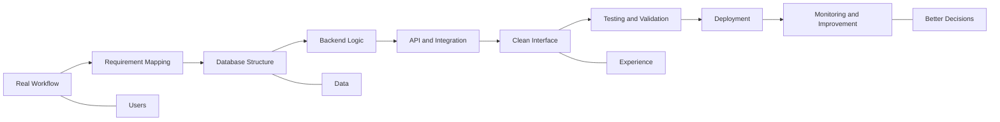

<!--
  GitHub Profile README for Umar Maulana
  Visual Direction: monochrome, premium, modern, animated, no emoji
  Domain: umrmaulana.my.id
-->

  

  
  
  
  

  
  
  
  

  

  
  
  

 

<table width="100%">
  <tr>
    <td width="58%" valign="top">
      <h2>Profile Brief</h2>
      

        I am an Informatics Engineering student focused on web and mobile application development. My work centers on building practical digital systems, internal dashboards, inventory workflows, mapping features, QR-based inspection flows, and tools that make operations easier to monitor.
      

      

        My background connects software development, data handling, inventory planning, UI thinking, and cross-functional collaboration in manufacturing and technology environments.
      

      

        I care about clean structure, precise execution, and systems that solve real workflow problems.
      

    </td>
    <td width="42%" valign="top">
      <h2>System Identity</h2>
      <pre><code>┌─ developer.profile ─────────────────┐
│ name       Umar Maulana             │
│ role       Web & Mobile Developer   │
│ location   Semarang, Indonesia      │
│ domain     umrmaulana.my.id         │
│ focus      Laravel, React, Flutter  │
│ method     Design, build, improve   │
│ status     Building useful systems  │
└─────────────────────────────────────┘</code></pre>
    </td>
  </tr>
</table>

 

<h2 align="center">Core Direction</h2>

<table width="100%">
  <tr>
    <td align="center" width="25%">
      <h3>Web Systems</h3>
      
Laravel dashboards, admin panels, internal tools, and workflow automation.

    </td>
    <td align="center" width="25%">
      <h3>Mobile Apps</h3>
      
Android and Flutter-based products with clean flows and practical features.

    </td>
    <td align="center" width="25%">
      <h3>Data Flow</h3>
      
Inventory, monitoring, reporting, API, database, and operational visibility.

    </td>
    <td align="center" width="25%">
      <h3>Visual Design</h3>
      
Interface structure, content layout, system diagrams, and user-facing clarity.

    </td>
  </tr>
</table>

 

<h2 align="center">Technology Stack</h2>

  
  
  
  
  
  
  
  
  

  
  
  
  
  
  
  
  
  
  
  

 

<h2 align="center">Skill Matrix</h2>

<table width="100%">
  <tr>
    <td width="50%" valign="top">
      <h3>Engineering</h3>
      
 Laravel ecosystem

      
 React and Next.js

      
 Flutter and mobile flow

      
 Database and API design

    </td>
    <td width="50%" valign="top">
      <h3>Product Thinking</h3>
      
 Workflow analysis

      
 Dashboard and reporting

      
 UI structure and visual layout

      
 Documentation and diagrams

    </td>
  </tr>
</table>

 

<h2 align="center">System Architecture Mindset</h2>

 

<h2 align="center">Selected Work</h2>

<table width="100%">
  <tr>
    <td width="50%" valign="top">
      <h3>SISCA</h3>
      
<b>System Information Safety Checksheet Aisin</b>

      
A Laravel-based system for emergency safety equipment checks at PT. Aisin Indonesia. Built around inspection status, area mapping, and QR code checking flow.

      
<b>Stack:</b> Laravel, MySQL, QR workflow, mapping, dashboard

    </td>
    <td width="50%" valign="top">
      <h3>System Inventory Aisin</h3>
      
<b>Warehouse and stock movement system</b>

      
A Filament Laravel system for warehouse operations, order flow, production movement, and stock monitoring.

      
<b>Stack:</b> Laravel, Filament, MySQL, admin panel

    </td>
  </tr>
  <tr>
    <td width="50%" valign="top">
      <h3>KLA Computer Mobile App</h3>
      
<b>Mobile sales application</b>

      
A mobile product sales app supported by dynamic product API and a web-based admin panel for product management.

      
<b>Stack:</b> Java, PHP, MySQL, REST API

    </td>
    <td width="50%" valign="top">
      <h3>WebGIS Kudus</h3>
      
<b>Geographic information system</b>

      
A website for HIV/AIDS case information by district in Kabupaten Kudus, supported by QGIS and admin-managed data.

      
<b>Stack:</b> PHP Native, QGIS, JavaScript, MySQL

    </td>
  </tr>
  <tr>
    <td width="50%" valign="top">
      <h3>Home Server Linux Armbian</h3>
      
<b>Personal server environment</b>

      
A self-managed server using STB TV, Armbian, aaPanel, Docker, and periodic maintenance workflow.

      
<b>Stack:</b> Linux, Armbian, Docker, aaPanel

    </td>
    <td width="50%" valign="top">
      <h3>Public Repository</h3>
      
<b>WebGIS project exploration</b>

      
Public repository for geospatial system exploration and web-based map interfaces.

      
<a href="https://github.com/umrmaulana/webGIS">github.com/umrmaulana/webGIS</a>

    </td>
  </tr>
</table>

 

<h2 align="center">Experience Timeline</h2>

<table width="100%">
  <tr>
    <td width="25%" align="center"><b>2021 - 2023</b> Planning Inventory Management PT. Astra Daihatsu Motor</td>
    <td width="25%" align="center"><b>2023 - Present</b> D3 Informatics Engineering Universitas Dian Nuswantoro</td>
    <td width="25%" align="center"><b>2024 - 2025</b> Head of Student Association Himpunan Mahasiswa</td>
    <td width="25%" align="center"><b>2025</b> SHE System Development PT. Aisin Indonesia</td>
  </tr>
</table>

 

<h2 align="center">GitHub Signal</h2>

  
  

  

  

  

 

<h2 align="center">Working Principles</h2>

<table width="100%">
  <tr>
    <td align="center" width="20%"><b>Understand</b> Start from the actual workflow and user problem.</td>
    <td align="center" width="20%"><b>Structure</b> Turn ideas into database, flow, and interface logic.</td>
    <td align="center" width="20%"><b>Build</b> Ship practical web and mobile systems.</td>
    <td align="center" width="20%"><b>Validate</b> Test features against real operational needs.</td>
    <td align="center" width="20%"><b>Improve</b> Maintain, refine, and make the system easier to use.</td>
  </tr>
</table>

 

<h2 align="center">Certifications</h2>

<table width="100%">
  <tr>
    <td width="33%" align="center"><b>Mobile Apps Development</b> LSP UDINUS, 2025</td>
    <td width="33%" align="center"><b>Code Generation and Optimization</b> IBM SkillBuild, 2025</td>
    <td width="33%" align="center"><b>Junior Web Development</b> LSP UDINUS, 2024</td>
  </tr>
  <tr>
    <td width="33%" align="center"><b>Fullstack Developer</b> Codepolitan, 2023</td>
    <td width="33%" align="center"><b>Junior Web Development</b> BNSP SKKNI, 2021</td>
    <td width="33%" align="center"><b>Continuous Learning</b> Software, systems, and design</td>
  </tr>
</table>

 

<h2 align="center">Connect</h2>

  
  
  

  <a href="https://umrmaulana.my.id">Portfolio</a> ·
  <a href="https://github.com/umrmaulana">GitHub</a> ·
  <a href="https://id.linkedin.com/in/umrmaulana">LinkedIn</a> ·
  <a href="https://instagram.com/umrmaulana">Instagram</a> ·
  <a href="https://x.com/umrmaulana">X</a> ·
  <a href="https://facebook.com/umrmaulana3">Facebook</a> ·
  <a href="https://t.me/Umrmaulana">Telegram</a> ·
  <a href="mailto:umrmaulana1@gmail.com">Email</a>

 

  

